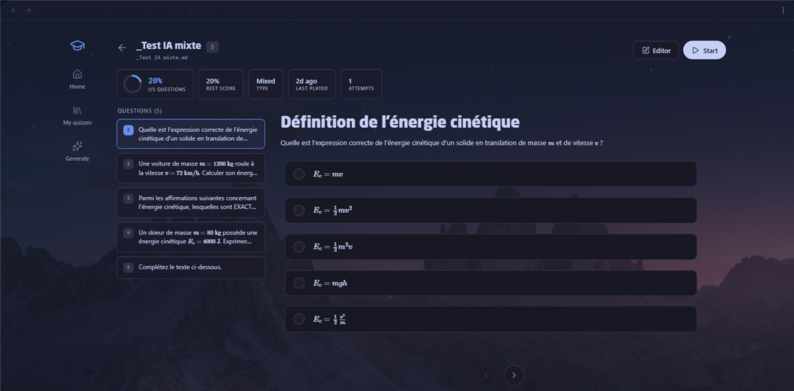

# Question types

Every type Neo Quiz renders, with a JSON5 example each. Paste any block into a ```quiz-blocks fence.


<details>
<summary><strong>Single Choice — one correct answer</strong></summary>


</details>

<details>
<summary><strong>Multiple Choice — several correct answers</strong></summary>


</details>

<details>
<summary><strong>Text Input — free text with validation</strong></summary>


</details>

<details>
<summary><strong>Command Line — terminal simulation</strong></summary>

Three variants available: **CMD**, **PowerShell**, and **Bash**.


</details>

<details>
<summary><strong>Ordering — drag & drop to arrange items</strong></summary>


</details>

<details>
<summary><strong>Matching — pair items from two columns</strong></summary>


</details>

<details>
<summary><strong>Fill in the Blanks — complete a text</strong></summary>

Write the whole sentence in `cloze` and wrap each blank in double braces.
Separate accepted variants with `|`:

```json5
{
  title: 'Networking',
  prompt: 'Complete the text below.',
  cloze: 'The {{DHCP}} protocol assigns an IP address, while {{DNS}} resolves names on port {{53}}.',
}
```

Every blank has the same width — a box sized to its answer would give away
the length of the word. Each blank is marked right or wrong on its own, and
the expected answer appears next to the ones that were missed.
</details>

<details>
<summary><strong>Numeric — a value, with a tolerance</strong></summary>

`3.14`, `3,14` and `3.140` are the same number, and a measurement is rarely
exact. Declare `numeric` and the answer is compared as a value:

```json5
{
  title: 'Physics',
  prompt: 'What is the acceleration due to gravity at the surface of the Earth?',
  type: 'text',
  numeric: true,
  tolerance: 0.05,     // or tolerancePercent: 2
  unit: 'm/s²',        // accepted as a suffix, never required
  answer: '9.81',
}
```

Fractions (`1/2`), thousands separators, scientific notation and the typographic
minus sign are all understood.
</details>

<details>
<summary><strong>Comprehension — one document, several questions</strong></summary>

A real exam is not only recall questions: it has a reading part, where one
document carries several questions. Give the questions the same `passageId`
and they all show the same document — only the first one carries the text:

```json5
[
  {
    passageId: 'doc1',
    passageTitle: 'Text: the greenhouse effect',
    passage: 'Long text to read before answering…',
    title: 'Main idea',
    prompt: 'What is the author arguing?',
    options: ['…', '…'],
    correctIndex: 0,
  },
  {
    passageId: 'doc1',        // same document, no need to repeat it
    title: 'Inference',
    prompt: 'What can be concluded from the third paragraph?',
    options: ['…', '…'],
    correctIndex: 1,
  },
]
```

The document sits at the top of the card, above the question title, and can be
folded away once read — folding it on one question folds it on all the others.
</details>

<details>
<summary><strong>Exam Mode</strong></summary>


Add an exam configuration object anywhere in your quiz array to enable timed sessions with a countdown timer and auto-submit.
</details>

<details>
<summary><strong>The quiz page</strong></summary>



Click a quiz in the Dashboard — or press `Ctrl+Shift+E` on a note that contains one — and you get its **page**: the question list on the left, the current question on the right, exactly as a learner will see it.

The **Editor** button turns that same page into an edit view, in place. No second screen, no panels to arrange.

- Add a question, choosing its type
- Edit every type: choices, ordering, matching, fill-in-the-blanks, numeric, terminal
- Attach a document, a resource, a hint, an explanation
- Reorder questions
- Set the quiz mode — quiz, learn or exam — and its timer
- Saves straight to your note as you type
</details>

---
